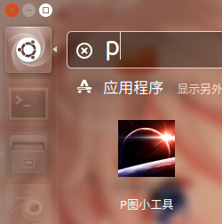

# P图小工具
## 使用本工具可以方便地为您的图片添加滤镜，改变风格。

### 开发环境：

+ Ubuntu 16.04
+ Visual Studio Code 1.38.1
+ opencv.js 3.4
+ bootstrap 4.3.1

### 完成情况：

+ 在线演示地址：https://www.hejiangda.tk/

+ 动图演示：

  

+ 网站打开截图：

+ | 用chrome浏览器打开                                           | 网站加载完成后可以点击地址栏中的加号进行安装 |
  | ------------------------------------------------------------ | -------------------------------------------- |
  |                                       |                       |
  | 安装好后再打开该网站可以看到在地址栏出现了使用已安装的程序打开该网站的提示 | 在桌面也会出现打开应用的图标                 |
  |                                       |                       |
  | 在应用菜单中也可以搜索到                                     | 双击该图标打开应用，会弹出一个应用程序的界面 |
  |                                       |                       |
  | 点击右上角三个点可以看到删除应用的选项                       | 点击后弹出删除界面                           |
  |                                       |                       |

+ 在手机上使用截图：

  | 用chrome浏览器打开                 | 如果经常打开该网站，会提示安装：   |
  | ---------------------------------- | ---------------------------------- |
  |           |           |
  | 点击后便可安装：                   | 安装后会在桌面上出现一个新的图标： |
  |           |           |
  | 点击后即可打开应用：               | 进入主界面：                       |
  |           |           |
  | 可以看到和原生应用看上去没有差别： |                                    |
  |           |                                    |

  